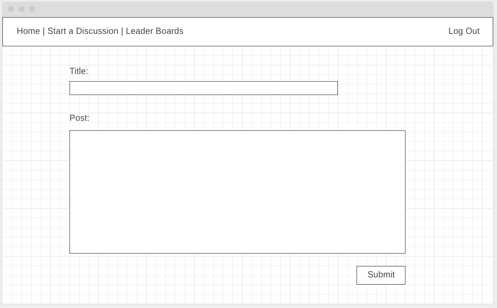
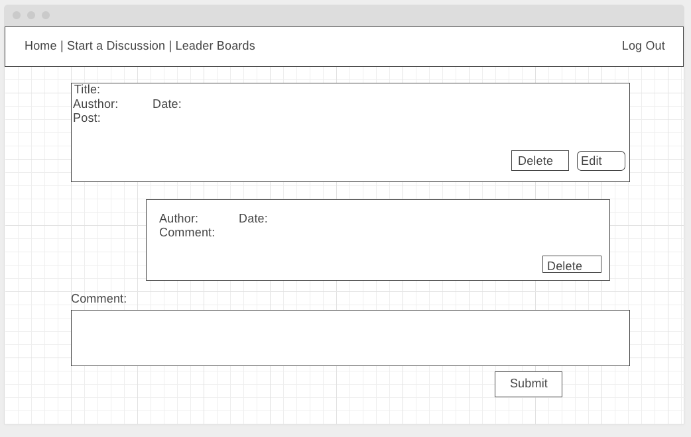

# F1 Forum

why am I making this app

## Wireframes

Landing view: 

Create post view:

show view:

Edit view:

## ERD:

## Technologies Used:

JavaScript
Html
CSS
VS Code
Mongoose
Mongo DB
Node.js
Express
Atlas
Google OAuth

### App screenshots

Landing view: 

Create post view:

Show view:

Edit view:

Api View:

### Website Link:

'https://forumula-1.herokuapp.com/'

## Future enhancements