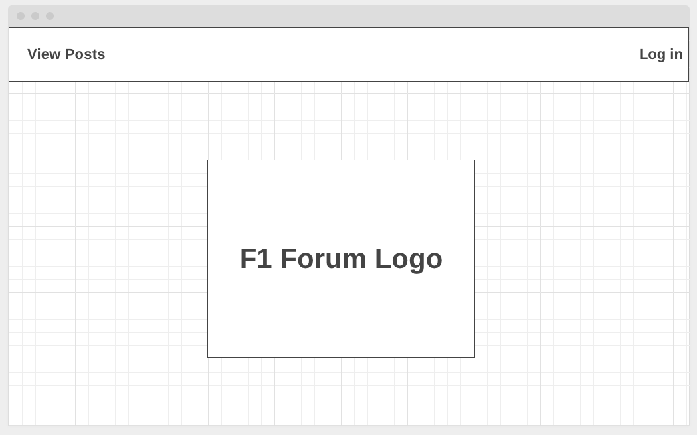
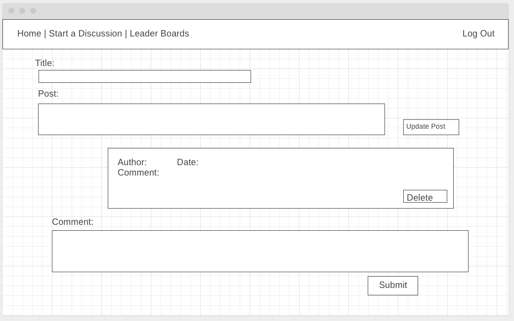

# Forum-ula 1

Welcome to Forum-ula 1, a racing based forum with live leader boards for drivers and constructors.

Simply log on with a Google email and post and comment on any racing subject.

## Wireframes

Landing view: 

Create post view:

show view:

Edit view:

## ERD:

## Technologies Used:

JavaScript, 
Html, 
CSS, 
VS Code, 
Mongoose, 
Mongo DB, 
Node.js, 
Express, 
Atlas, 
Google OAuth.

### App screenshots

Landing view: 

Create post view:

Show view:

Edit view:

Api View:

### Website Link:

https://forumula-1.herokuapp.com/

## Future enhancements

- Futher functionality for searching driver stats and results.
- A user can save favorite drivers and teams.
- Like posts and comments.
- Profile information in nav bar for logged in user (avatar and Name).